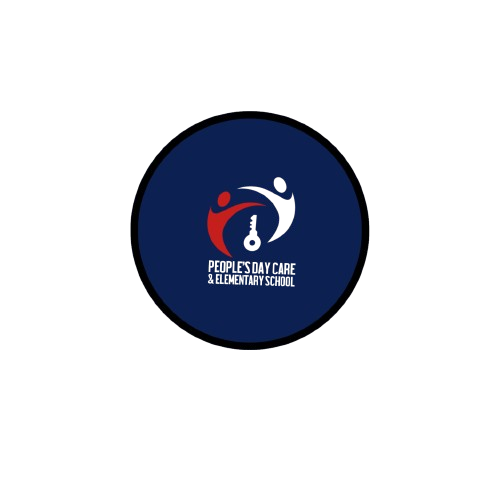

 ## School Website

This a client website*School Website*, is a web application designed to help the school with keep up with there information to the public. Only those who have logged in is allows to create,add,delete teacher/staff info from the database. 

## Getting Started  
[Link to Deployed App](<https://labstocker.netlify.app/>)

## Attributions  
- [Responsive Navbar in React using React Rou]
[Beginners | Responsive Menu | HTML & CSS Quick Tips](https://www.youtube.com/watch?v=17l6AOc8s10)
- [Resposive DropDown Menu using HTML & CSS]
[Simple Dropdown Menu Using HTML & CSS](https://www.youtube.com/watch?v=dmFC1e_CUAQ)
- [Responsive Navbar in React using React Rou
[Simple Dropdown Menu Using HTML & CSS](https://www.youtube.com/watch?v=dmFC1e_CUAQ)

## Technologies Used  
HTML  
CSS  
JS  
-Django
-Python

## Next Steps  

Next steps would be to implement and image to seperate teachers and create more page to the site.
